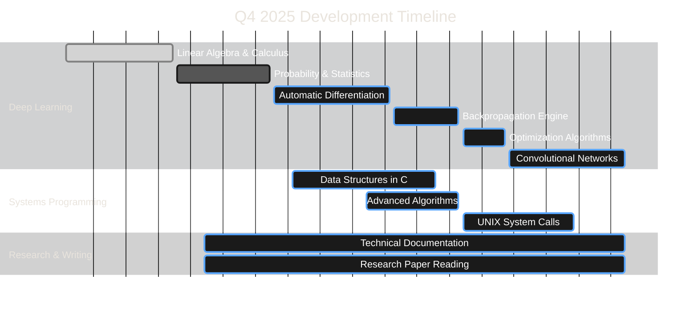

<div align="center">

# Rafeeq Inea

**AI Systems Engineer | Deep Learning Researcher**

[](https://git.io/typing-svg)

<br/>

[](https://github.com/rafeeqinea)
[](mailto:rafeeqinea@gmail.com)
[](https://www.linkedin.com/in/mohammed-rafeeq-faraaz-shaik-2a1b29249/)


</div>

---

## About

**BSc Computer Science** @ University of Greenwich (Year 3) | **42 Piscine Graduate**

I build AI systems from first principles with a focus on understanding every layer of the stack. My work emphasizes clean implementations, mathematical rigor, and production-ready code. Currently developing a neural network engine in pure Python while maintaining proficiency in systems programming through C.

**Research Interests:** Deep learning architectures, automatic differentiation, optimization algorithms, systems-level ML

**Open to:** Research collaborations, internship opportunities, technical discussions

---

## Current Work

### Neural Network Engine
**[deep-learning-from-scratch](https://github.com/rafeeqinea/deep-learning-from-scratch)**

Building a neural network framework from mathematical foundations in pure Python. This project emphasizes understanding over abstraction.

**Implementation Progress:**
- ✅ Matrix operations and tensor manipulation
- ✅ Forward propagation with multiple activation functions
- ✅ Automatic differentiation engine
- 🔄 Backpropagation optimization
- 🔄 Optimizer suite (SGD, Adam, RMSprop)
- 📋 Convolutional layers

**Technical Focus:** Numerical stability, computational efficiency, clean abstractions

**Stack:** Python, NumPy, Matplotlib

---

## Projects

<table>
<tr>
<td width="50%" valign="top">

### Deep Learning from Scratch
**[Repository](https://github.com/rafeeqinea/deep-learning-from-scratch)**

Neural network framework built from mathematical foundations in pure Python. Implements forward/backward propagation, automatic differentiation, and multiple optimization algorithms.

**Stack:** Python, NumPy, Matplotlib

**Focus:** Understanding every layer of neural network computation

</td>
<td width="50%" valign="top">

### Stock Market Forecasting using GRU
**[Repository](https://github.com/rafeeqinea/Stock-Market-Forecasting-using-GRU)**

Time-series forecasting system using Gated Recurrent Units for stock price prediction. Includes data preprocessing, hyperparameter tuning, and comprehensive evaluation.

**Stack:** Python, TensorFlow/Keras, Pandas

**Focus:** Applying deep learning to financial time-series data

</td>
</tr>
<tr>
<td width="50%" valign="top">

### BlockSense Analytics
**[Repository](https://github.com/rafeeqinea/blocksense)**

Real-time blockchain analytics platform with ML-powered anomaly detection. Monitors transaction patterns and identifies suspicious activity across Ethereum and BSC networks.

**Stack:** Python, Web3.py, Scikit-learn

**Focus:** Security intelligence for blockchain transactions

</td>
<td width="50%" valign="top">

### BlockSense dApp
**[Repository](https://github.com/rafeeqinea/blocksense-dapp)**

Decentralized application that reads and displays real-time data from BlockSense's data feeds. Features wallet connection and dark mode interface.

**Stack:** JavaScript, Web3, React

**Focus:** User-friendly blockchain data visualization

</td>
</tr>
<tr>
<td width="50%" valign="top">

### London Underground System
**[Repository](https://github.com/rafeeqinea/London-Underground-System)**

Graph-based transport network simulation implementing Dijkstra's shortest-path algorithm on real Transport for London data for optimal journey planning.

**Stack:** Python, NetworkX, Pandas

**Focus:** Practical graph theory applications

</td>
<td width="50%" valign="top">

### SAIL to CGEN Compiler
**[Repository](https://github.com/rafeeqinea/SAIL-to-CGEN-Coding-Challenge)**

Converter that transforms structured YAML/JSON data into LISP-style S-expressions. Part of a coding challenge demonstrating parsing and code generation.

**Stack:** Python, YAML, JSON

**Focus:** Data structure transformation and parsing

</td>
</tr>
<tr>
<td width="50%" valign="top">

### Supermarket Queue Simulation
**[Repository](https://github.com/rafeeqinea/Supermarket-Checkout-Lane-Queue-Simulation)**

Object-oriented simulation system modeling supermarket checkout lanes with dynamic queue management and customer flow optimization.

**Stack:** Python, OOP

**Focus:** Discrete event simulation and queue theory

</td>
<td width="50%" valign="top">

### Palindrome Prime Counter
**[Repository](https://github.com/rafeeqinea/Palindrome-Prime-Number-Counter)**

Optimized algorithm to efficiently find and count palindromic prime numbers within large ranges, demonstrating algorithm optimization techniques.

**Stack:** Python

**Focus:** Algorithm optimization and number theory

</td>
</tr>
</table>

---

## Technical Skills

<div align="center">

**Core Languages**


**AI/ML Stack**


**Development Tools**


</div>

---

## Development Philosophy

```python
class Approach:
    """My development methodology"""
    
    principles = {
        "clarity": "Code should be self-documenting",
        "performance": "Profile before optimizing",
        "testing": "Write tests for critical paths",
        "iteration": "Ship incrementally, gather feedback"
    }
    
    @staticmethod
    def evaluate(code):
        """Quality checks before shipping"""
        assert is_readable(code), "Readability is paramount"
        assert has_tests(code), "Test critical functionality"
        assert is_maintainable(code), "Future you will thank you"
        return code
```

**Core Principles:**
- **Understand deeply:** If you can't explain it simply, keep learning
- **Measure always:** Profile before optimization, benchmark after
- **Document clearly:** Code tells how, comments tell why
- **Ship iteratively:** Feedback beats perfection in isolation

---

## GitHub Analytics

<div align="center">


</div>

---

## Development Roadmap



**Current Phase:** Mathematical foundations and implementation of core neural network components

**Next Milestones:**
- Complete backpropagation optimization (Nov 2025)
- Implement CNN layers (Dec 2025)
- Publish technical writeups on implementation challenges

---

## Collaboration

I'm interested in working with researchers, engineers, and teams focused on:

**Research Areas:**
- Neural network interpretability
- Optimization algorithms
- Systems-level machine learning
- Educational tools for ML concepts

**Project Types:**
- Open source ML frameworks
- Performance optimization challenges
- Research implementations
- Production ML systems

**What I Offer:**
- Strong mathematical foundation in ML
- Systems programming expertise
- Clean, well-documented code
- Collaborative approach to problem-solving

**Contact:**
- Email: rafeeqinea@gmail.com
- GitHub: [@rafeeqinea](https://github.com/rafeeqinea)
- LinkedIn: [Mohammed Rafeeq Faraaz Shaik](https://www.linkedin.com/in/mohammed-rafeeq-faraaz-shaik-2a1b29249/)

---

<details>
<summary><b>Extended Analytics</b></summary>

<br/>

### Weekly Coding Activity
<!--START_SECTION:waka-->
```
Python      12 hrs 34 mins  ████████████░░░░░   60%
C            4 hrs 12 mins  ████░░░░░░░░░░░░   20%
Markdown     2 hrs 5 mins   ██░░░░░░░░░░░░░░   10%
JavaScript   1 hr 15 mins   █░░░░░░░░░░░░░░░    6%
Other           50 mins     ░░░░░░░░░░░░░░░░    4%
```
<!--END_SECTION:waka-->

### Contribution Visualization
<!-- Enable via GitHub Actions: Platane/snk -->


</details>

---

<div align="center">


**© 2025 Rafeeq Inea** • Open to collaboration and opportunities

[](https://github.com/rafeeqinea)
[](mailto:rafeeqinea@gmail.com)

</div>
